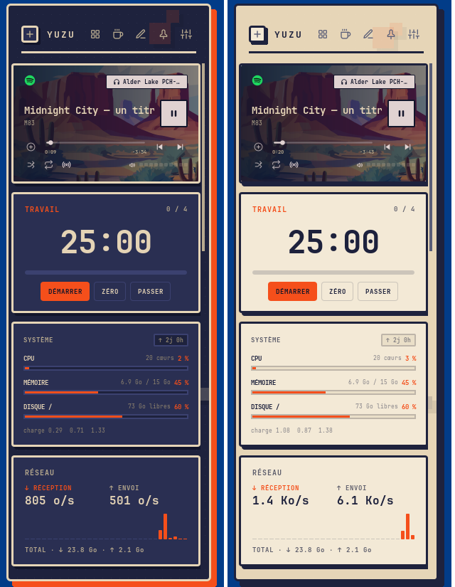
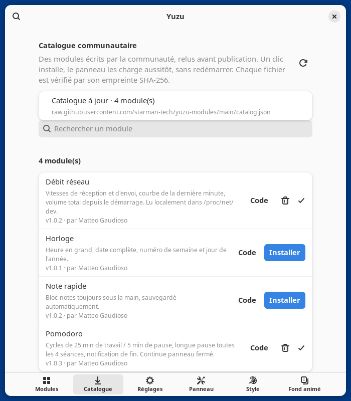

<p align="center">
  
</p>

<h1 align="center">Yuzu</h1>

<p align="center">
  <b>A floating side panel for GNOME Shell, made of the cards you choose.</b><br>
  Media player, time tracker, to-do list, system monitor, weather, markets…
  and one-click community modules, without ever restarting the shell.
</p>

<p align="center">
  
  <a href="https://github.com/starman-tech/yuzu/releases/latest"></a>
  <a href="https://github.com/starman-tech/yuzu/actions/workflows/ci.yml"></a>
  <a href="LICENSE"></a>
</p>

<p align="center">
  <a href="#install">Install</a> ·
  <a href="#modules">Modules</a> ·
  <a href="https://github.com/starman-tech/yuzu-modules">Community catalog</a> ·
  <a href="docs/MODULES.md">Write a module</a> ·
  <a href="README.fr.md">Français</a>
</p>

<p align="center">
  
  
</p>

---

## Why Yuzu

- **Only what you want.** Every card is a module. Pick yours when installing,
  switch them on and off in the preferences, reorder them by dragging.
- **Out of the way.** The panel slides in when you touch the right edge of the
  screen, or with `Super+P`, and slides away when you leave.
- **Grows with you.** Browse the community catalog from the preferences and
  install a module in one click: the card appears immediately and updates
  apply live. Each file is checked against the SHA-256 published in the catalog.
- **Looks the part.** Neo-brutalist design — thick outlines, hard shadows, one
  orange accent — in a dark and a light theme, with an animated background
  that only runs while the panel is open.
- **Private by default.** Everything runs locally except the modules that
  obviously need the network, and the two features that send your data to a
  third party stay off until you turn them on.

## Install

```bash
curl -fsSL https://raw.githubusercontent.com/starman-tech/yuzu/main/install.sh | bash
```

The installer asks which modules you want, then tells you how to start the
extension (log out and back in on Wayland, `Alt+F2` → `r` on X11). No `sudo`,
nothing written outside your home folder.

<details>
<summary><b>Other ways to install</b></summary>

**From a clone**, to follow `main` or to hack on it:

```bash
git clone https://github.com/starman-tech/yuzu
cd yuzu
./install.sh                          # asks which modules to enable
./install.sh --defaults               # default modules, no questions
./install.sh --modules player,todo,weather
```

**From a release zip**: download `yuzu-plus@starman-tech.github.io-v*.zip`
from the [releases](https://github.com/starman-tech/yuzu/releases), then

```bash
gnome-extensions install --force yuzu-plus@starman-tech.github.io-v*.zip
```

and log out and back in. You are offered to pick your modules on first launch.

**Coming from Side Panel** (the previous name): run `install.sh`. It removes
the old extension and brings over your settings and data.

**Uninstall**: `./install.sh --uninstall` (your data stays in `~/.config/yuzu`).
</details>

### Two editions

| | extensions.gnome.org | GitHub (this repository) |
|---|---|---|
| Install from | the GNOME Extensions app | `install.sh` or the release zip |
| Community modules | bundled — enable the ones you want | installed live from the catalog, plus your own `.js` files |
| AI assistant, selection rewrite | — | optional, off by default |
| UUID | `yuzu@starman-tech.github.io` | `yuzu-plus@starman-tech.github.io` |

Install one or the other, not both. Both are built from this source; the
extensions.gnome.org edition (`tools/build.sh --ego`) leaves out the code
that loads modules at run time or runs commands, which the review rules forbid.

## Use

| | |
|---|---|
| Open | Touch the right edge of the screen, or `Super+P` (which also pins it) |
| Pin | The pin button keeps the panel open |
| Rearrange | The pencil button, then drag a card or use its arrows |
| Put a card away | Edit mode → *ranger*: it goes to the library at the bottom, one click brings it back |
| Grid view | The grid button shows modules as app icons; a click opens one full size |
| Add modules | **＋** → *Catalogue*, or Preferences → *Catalogue* |
| Stay awake with the lid closed | The coffee cup button ([details](#stay-awake-with-the-lid-closed)) |

## Modules

| Module | What it does | Network |
|---|---|---|
| **Lecteur** · player | MPRIS player (Spotify, Firefox, VLC…): cover art, accent colour taken from the cover, audio output switcher, favourites | cover art URLs from the player |
| **Suivi du temps** · tracker | Time spent per application today, measured locally | — |
| **Marché & actualités** · market | BTC, ETH, SPY, S&P 500 intraday and related headlines | Yahoo Finance, Google News |
| **Tâches** · todo | To-do list | — |
| **Système** · sysmon | CPU, memory, disk, load, uptime from `/proc` | — |
| **Météo** · weather | Current conditions and 5-day forecast | open-meteo.com |
| **Calendrier** · calendar | Clock and month grid | — |
| **Favoris** · launcher | Your dock's favourite applications | — |
| **Assistant IA** · assistant | Groq chat that knows your terminal's folder and suggests commands · *GitHub edition, off by default* | api.groq.com |

**From the [community catalog](https://github.com/starman-tech/yuzu-modules):**
Pomodoro, network speed, quick note, clock — and whatever you publish next.
A module is [a single JavaScript file](docs/MODULES.md).

### Privacy

Everything is local unless listed in the *Network* column. Two features of
the GitHub edition send your data to a third party, and both stay **off until
you turn them on**:

- **Assistant IA** sends Groq the working directory of the terminal in the
  foreground, its running command and its last history lines, and can run
  read-only commands (`ls`, `find`, `git status`…) to explore folders.
- **Réécriture de la sélection** (a global shortcut, `Ctrl+M` by default)
  sends the selected text to Groq to correct, translate, rephrase or summarise it.

Both need your own Groq API key (Preferences → *Réglages*), stored in
GSettings, readable by any program running as your user.

Community modules run inside GNOME Shell with your permissions. They are
reviewed before being merged, their source is one click away in the
preferences, and the catalog shows which hosts each one contacts. Still, only
install what you trust.

### Stay awake with the lid closed

The coffee cup blocks suspend on lid close: the screen locks and turns off,
but builds, downloads and terminals keep running. Two inhibitors (logind
`handle-lid-switch`, gnome-session `suspend`) are released automatically if
the shell stops; nothing on the system is modified. Check with
`systemd-inhibit --list | grep -i yuzu`. The setting survives reboots, so turn
it off before putting the laptop in a bag.

This is why the extension also runs on the lock screen: otherwise GNOME would
disable it, and release the inhibitor, at the very moment the lid closes. The
panel itself is removed while the screen is locked.

## Troubleshooting

| Symptom | Fix |
|---|---|
| `gnome-extensions enable` says the extension doesn't exist | The shell has not rescanned yet: log out and in (Wayland) or `Alt+F2` → `r` (X11) |
| A card shows **ERREUR** | The module failed to load; the message is on the card and *Retirer* removes it. Log: `journalctl -b -o cat /usr/bin/gnome-shell \| grep -i yuzu` |
| Nothing happens at the screen edge | Increase *Zone de déclenchement* in Preferences → *Panneau*, or use `Super+P` |
| The catalog is unreachable | Offline, the last downloaded copy is shown |
| No cover art | The player does not publish `mpris:artUrl` (common with browsers) |
| Background blur freezes the shell | Some drivers (NVIDIA on X11) do not cope: turn off *Flou de l'arrière-plan* in Preferences → *Style* |

The interface is in French for now; [translations are welcome](CONTRIBUTING.md#translations).

## Development

```bash
tools/nested.sh           # isolated nested GNOME Shell running the working copy
tools/nested.sh --ego     # same, with the extensions.gnome.org edition
tools/smoke.sh            # scripted run, fails on any error in the log
tools/lint.sh             # syntax, missing imports, schema, metadata
tools/build.sh [--ego]    # release zip
```

`tools/nested.sh` keeps its configuration, data and dconf database in
`.run/sandbox`, so testing never touches your session. See
[CONTRIBUTING.md](CONTRIBUTING.md), and [docs/ARCHITECTURE.md](docs/ARCHITECTURE.md)
for the internals (in French).

## Author

Made by **Matteo Gaudioso**. Released under the
[GNU General Public License v3.0 or later](LICENSE).
